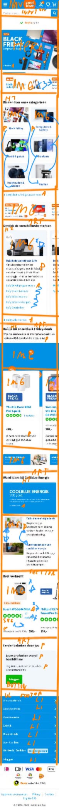
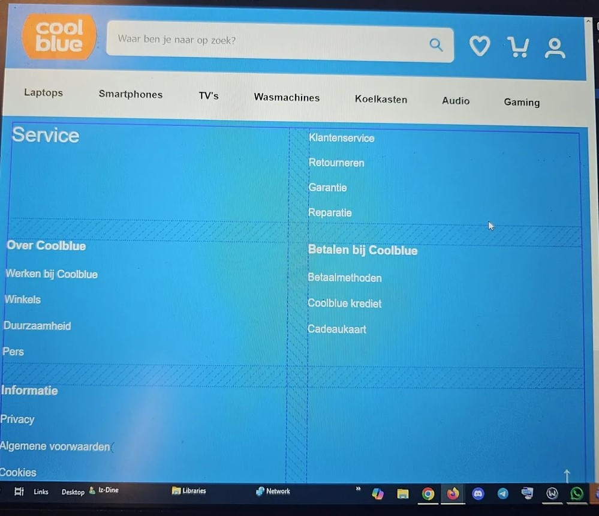
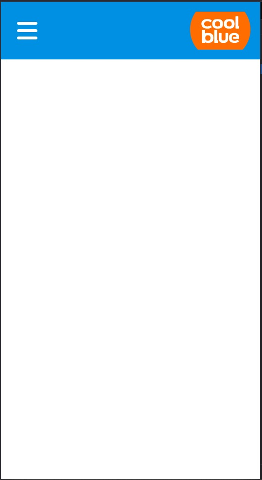
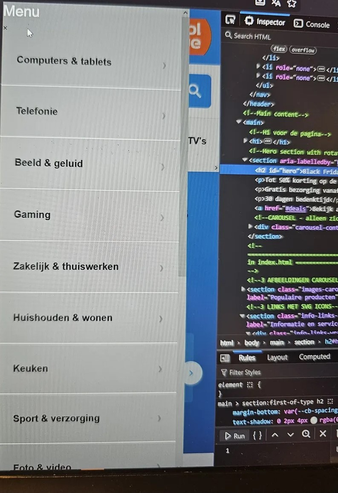
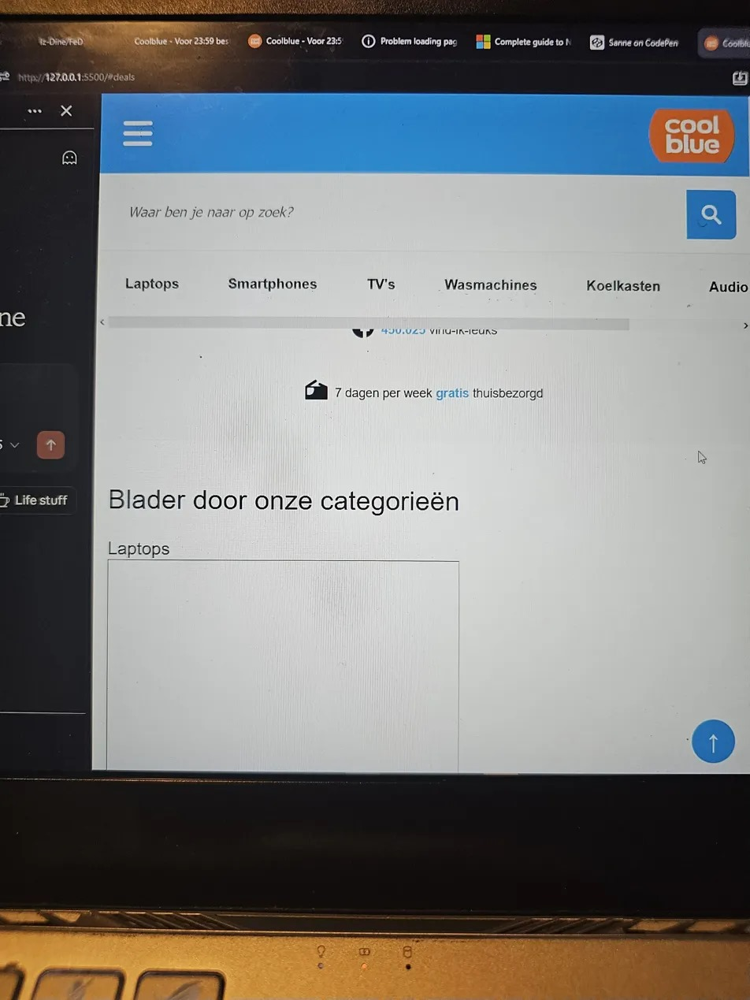

# Procesverslag
**Auteur:** Iz-Dine Amadou

Markdown is een simpele manier om HTML te schrijven.  
Markdown cheat cheet: [Hulp bij het schrijven van Markdown](https://github.com/adam-p/markdown-here/wiki/Markdown-Cheatsheet).

Nb. De standaardstructuur en de spartaanse opmaak van de README.md zijn helemaal prima. Het gaat om de inhoud van je procesverslag. Besteedt de tijd voor pracht en praal aan je website.

Nb. Door *open* toe te voegen aan een *details* element kun je deze standaard open zetten. Fijn om dat steeds voor de relevante stuk(ken) te doen.

## Jij

uitwerken voor kick-off werkgroep

### Auteur:
Iz-Dine Amadou

#### Je startniveau:
Rood

#### Je focus:
Responsive

## Je website

uitwerken voor kick-off werkgroep

### Je opdracht:
[Coolblue.nl](https://www.coolblue.nl/?srsltid=AfmBOor2RF4MS3NCHYrnD7LljHlmEKKAmpuZxGipUGfcfNXlVM_shN_V)

#### Screenshot(s) van de eerste pagina (small screen): 
**Home page**

#### Screenshot(s) van de tweede pagina (small screen):
**Gaming laptops page**

## Toegankelijkheidstest 1/2 (week 1)

uitwerken na test in 2e werkgroep

### Bevindingen
Coolblue heeft een aantal toegankelijkheidsproblemen:

#### Screenreader
- Geen alt teksten bij sommige images
- Geen aria-labels bij buttons en links
- Onduidelijke link teksten

#### Muis en Toetsenbord 
- Navigatie met toetsenbord werkt redelijk goed
- Focus states zijn aanwezig maar kunnen duidelijker

#### Motoriek (shocks, elastiekjes)
- Knoppen zijn over het algemeen groot genoeg
- Interactieve elementen zijn goed te raken

#### Visueel (brillen, contrast, kleurenblind, dark/light). 
- Slechte kleurcontrasten tussen tekst en achtergrond
- Tekst is soms moeilijk leesbaar door klein lettertype
- Geen dark mode optie
- Contrast ratio voldoet niet altijd aan WCAG richtlijnen

## Breakdownschets (week 1)

uitwerken na afloop 3e werkgroep

### De hele pagina: 

### Dynamisch deel (bijv menu): 

### Wellicht nog een dynamisch deel (bijv filter): 

## Voortgang 1 (week 2)

uitwerken voor 1e voortgang

### Stand van zaken
De basis structuur staat en ik heb begonnen met het opzetten van de HTML. Het gaat best wel goed, alleen met semantic HTML heb ik nog moeite. Ik weet niet zo goed hoe ik sommige delen moet doen zonder divs en spans te gebruiken. Ik denk dat ik het best kan omzetten naar `section`, `article`, `nav` etc.

**Dit ging goed:**
- Remedy en root CSS files toegevoegd
- Variabelen en reset CSS opgezet
- Begin structuur van HTML pagina gemaakt

**Dit was lastig:**
- Semantic HTML toepassen zonder divs/spans
- Bepalen wanneer ik welke semantic tags moet gebruiken

### Agenda voor meeting
samen met je groepje opstellen

| Iz-Dine           | Student 2          | Student 3    | Student 4        |
| ----------------- | ------------------ | ------------ | ---------------- |
| Structuur HTML OK?| en dit             | en ik dit    | en dan ik dat    |
| Div voor overlay? | dit als er tijd is | nog een punt | dit wil ik zeker |
| Download button?  | ...                | ...          | ...              |

### Verslag van meeting
hier na afloop snel de uitkomsten van de meeting vastleggen

#### Goed:
- Het gebruik van aria-labels is goed toegepast
- Het gebruik van buttons voor interactieve elementen is correct
- De navigatie is semantisch correct opgezet met nav-elementen

#### Verbeterpunten:
- De alt tekst kan soms wat beter, bijvoorbeeld bij het hamburger menu
- Images in articles moeten onderaan gezet worden (H2 en P zijn belangrijker), styling kan ze naar boven verplaatsen
- Het `type` attribuut bestaat niet bij buttons
- De 3 articles voor code etc hoeven niet in een list, een div is hier acceptabel voor styling
- Losse `<a>` tags hoeven niet in een list, is overbodig

#### Kennispunten:
- Voor JavaScript mogen wel ID's gebruikt worden
- Een `<figure>` is een foto met caption die informatie geeft, maar `` is voldoende
- Position zou voor het hamburger menu een acceptabele manier zijn om te stylen
- Data attributen zijn niet nodig maar mogen wel gebruikt worden (wordt afgeraden)

## Voortgang 2 (week 3)

uitwerken voor 2e voortgang

### Stand van zaken
Code structuur verbeterd voor betere leesbaarheid en onderhoudbaarheid. Styling begint vorm te krijgen en ik snap flexbox en grid steeds beter.

**Dit ging goed:**
- Flex en Grid beginnen te snappen
- Custom properties goed gebruiken
- Code structuur veel overzichtelijker

**Dit was lastig:**
- Foto's en achtergrond schalen voor verschillende schermformaten
- Bepalen of iets een H2 of H3 moet zijn

### Agenda voor meeting
samen met je groepje opstellen

| Iz-Dine              | Ronald                   | Tijn                | Daniel              |
| -------------------- | ------------------------ | ------------------- | ------------------- |
| CSS gebruik goed?    | CSS comments duidelijk?  | Grid structuur OK?  | Custom properties?  |
| Alt teksten OK?      | Flex voor sectie 4?      | ...                 | ...                 |
| Loop ik bij/achter?  | Footer H2 of H3?         | ...                 | ...                 |

### Verslag van meeting
hier na afloop snel de uitkomsten van de meeting vastleggen

#### Goed:
- CSS gaat goed
- Structuur wordt steeds beter

#### Verbeterpunten:
- Gebruik een `<svg>` voor het stylen van de "latest version" knop
- Maak het icoontje voor het hamburger menu een button

#### Kennispunten:
- Bij een label met `for` attribuut moet je een ID gebruiken (het moet zelfs)
- In plaats van `list-style: none` gebruik `list-style-type: ""`
- Gebruik `flex-basis` voor de `<li>` elementen
- Gebruik `flex-grow` voor het opvullen van ruimte
- Zet images op `display: block` om de line eronder te verwijderen
- Voor light/dark mode zet `color-scheme: light dark` bovenaan
- Zet in de `:root` de `font-family`, niet in html/body
- Voor grid is er ook `max-content`
- Voor grid is er ook `grid-template-areas`
- In grid heb je ook `column-gap`
- Je kunt ook `nth-of-type(even)` gebruiken voor even elementen
- `&` is voor een bijzonderheid in de code
- CSS in volgorde van HTML: bovenaan generieke dingen, onderaan specifieke dingen
- Van groot naar klein in CSS
- Efficiënte CSS schrijven is niet het doel, het doel is begrijpbare code
- Bij width kan `fit-content` gebruikt worden
- `margin-inline` mag gebruikt worden als je geen flex of grid gebruikt
- `::after` kan gebruikt worden met `display: flex` en `gap` voor ruimte
- Bij `::after` moet er `content: ""` zijn, maar deze mag leeg blijven
- Voor download button moet echt een `<svg>` gebruikt worden, geen `::after`

## Toegankelijkheidstest 2/2 (week 4)

uitwerken na test in 9e werkgroep

### Bevindingen
Lijst met je bevindingen die in de test naar voren kwamen:

#### Verbeterd:
- Alt teksten zijn nu wel toegevoegd
- Aria-labels zijn toegepast op buttons
- Focus states zijn duidelijker gemaakt
- Kleurcontrast is verbeterd

#### Nog te verbeteren:
- Dark mode implementeren
- Keyboard navigatie verder optimaliseren
- Sommige interactieve elementen kunnen nog toegankelijker

## Voortgang 3 (week 4)

uitwerken voor 3e voortgang

### Stand van zaken
Loop een beetje achter. Ik heb moeite met het omzetten van mijn eigen code naar semantic code zonder classes, divs en spans. Veel dingen breken en ik ben bang dat ik het niet op tijd af krijg. Ik heb er wel veel tijd in gestoken maar het is niet helemaal zoals ik het wil hebben.

**Dit ging goed:**
- Light/dark mode styling toegevoegd
- Mobile navigatie werkend gekregen
- User interactions verbeterd

**Dit was lastig:**
- Semantic HTML zonder classes/divs/spans
- Code blijft breken bij aanpassingen
- Tijdsmanagement

### Agenda voor meeting
samen met je groepje opstellen

| Iz-Dine           | Student 2          | Student 3    | Student 4        |
| ----------------- | ------------------ | ------------ | ---------------- |
| Semantic HTML?    | en dit             | en ik dit    | en dan ik dat    |
| Tijd management?  | dit als er tijd is | nog een punt | dit wil ik zeker |
| ...               | ...                | ...          | ...              |

### Verslag van meeting
hier na afloop snel de uitkomsten van de meeting vastleggen

- [Vul hier de uitkomsten van je meeting in]

## Eindgesprek (week 5)

uitwerken voor eindgesprek

### Je uitkomst - karakteristiek screenshots:

### Dit ging goed/Heb ik geleerd: 
**Geleerd:**
- Flexbox en Grid beter begrijpen en gebruiken
- Nieuwe semantic HTML elementen leren gebruiken
- CSS selectors beter leren gebruiken zoals `:has()` en `nth-of-type()`
- Data attributes leren gebruiken
- `<search>` element leren gebruiken

### Dit was lastig/Is niet gelukt:
Ik vind het lastig om alles helemaal semantisch te maken zonder divs en spans te gebruiken. Sommige delen breken dan en ik kan het wel, maar het is niet helemaal zoals ik het wil hebben.

**Niet gelukt:**
- De 2e pagina ben ik niet aan toegekomen
- Carousel werkt niet meer
- Ben eerlijk gezegd nu ook de draad kwijt met de werkende en niet werkende versies van code
- Sommige interacties zijn niet af
- Responsive design is niet volledig uitgewerkt

## Bronnenlijst

continu bijhouden terwijl je werkt

Nb. Wees specifiek ('css-tricks' als bron is bijv. niet specifiek genoeg). 
Nb. ChatGpT en andere AI horen er ook bij.
Nb. Vermeld de bronnen ook in je code.

### CSS & JavaScript:
1. [CSS Nesting](https://developer.mozilla.org/en-US/docs/Web/CSS/CSS_nesting)
2. [CSS :has() selector](https://developer.mozilla.org/en-US/docs/Web/CSS/:has)
3. [Data Attributes Guide](https://css-tricks.com/a-complete-guide-to-data-attributes/)
4. [A11y Project Checklist](https://www.a11yproject.com/checklist/)
5. [WCAG Guidelines](https://www.w3.org/WAI/standards-guidelines/wcag/)
6. [PX to EM Converter](https://nekocalc.com/px-to-em-converter)

### Semantic HTML:
1. [Semantics - MDN](https://developer.mozilla.org/en-US/docs/Glossary/Semantics)
2. [Search Element](https://developer.mozilla.org/en-US/docs/Web/HTML/Element/search)
3. [Article Element](https://developer.mozilla.org/en-US/docs/Web/HTML/Element/article)
4. [Section Element](https://developer.mozilla.org/en-US/docs/Web/HTML/Element/section)
5. [Nav Element](https://developer.mozilla.org/en-US/docs/Web/HTML/Element/nav)
6. [Header Element](https://developer.mozilla.org/en-US/docs/Web/HTML/Element/header)
7. [Footer Element](https://developer.mozilla.org/en-US/docs/Web/HTML/Element/footer)

### Performance:
1. [Cumulative Layout Shift](https://web.dev/cls/)
2. [Lazy Loading Images](https://web.dev/lazy-loading-images/)
3. [Intersection Observer API](https://developer.mozilla.org/en-US/docs/Web/API/Intersection_Observer_API)

### Accessibility:
1. [ARIA Overview](https://developer.mozilla.org/en-US/docs/Web/Accessibility/ARIA)
2. [Button Role](https://developer.mozilla.org/en-US/docs/Web/Accessibility/ARIA/Roles/button_role)
3. [Aria-expanded](https://developer.mozilla.org/en-US/docs/Web/Accessibility/ARIA/Attributes/aria-expanded)
4. [Aria-label](https://developer.mozilla.org/en-US/docs/Web/Accessibility/ARIA/Attributes/aria-label)
5. [Aria-labelledby](https://developer.mozilla.org/en-US/docs/Web/Accessibility/ARIA/Attributes/aria-labelledby)
6. [WAI-ARIA Spec](https://www.w3.org/TR/wai-aria-1.1/)
7. [Keyboard Techniques](https://webaim.org/techniques/keyboard/)

